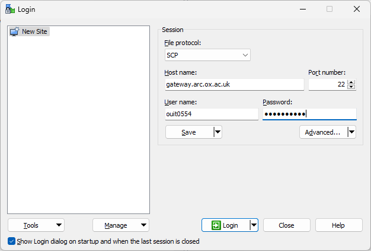
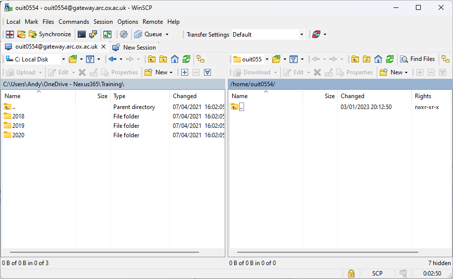
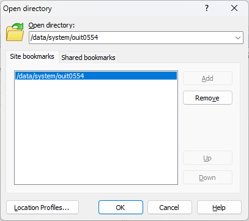
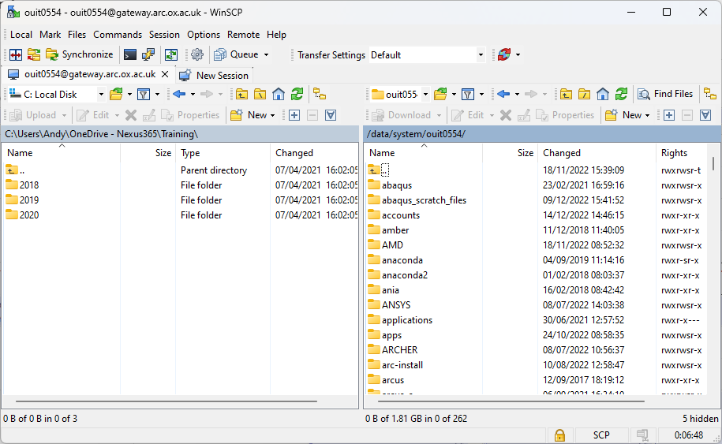
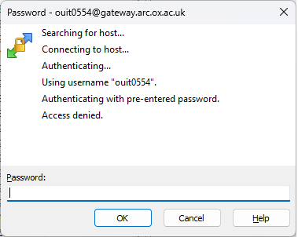

Copying data to/from ARC
------------------------

MacOS/Linux users (and other Unix like operating systems) can use the command line utilities ``rsync``, ``sftp``, or ``scp`` directly to copy data to or from the ARC systems. These commands **must** to be run on your **local** machine as you can only pull files from ARC or push files to it.  

.. note::

    $HOME and $DATA are shared between the ARC and HTC systems, so the instructions below will work for both systems. ``gateway.arc.ox.ac.uk`` has no access to $HOME, but $DATA is available. 

Copying to the ARC systems
^^^^^^^^^^^^^^^^^^^^^^^^^^

1) Make sure you know the full path to the destination directory on ARC - The best way to to this is to log in to ARC, change to that directory and run the command ``pwd``; this will show you the full path to the directory. 

For example if you have created a directory ``myscripts`` in $DATA, ``pwd`` will show output like::

    [ouit0578@gateway]$ cd $DATA/myscripts
    [ouit0578@gateway]$ pwd
    /data/system/ouit0578/myscripts

2) On your local Mac or Linux PC open a terminal window and change directory to the directory where the file(s) you want to copy **to** ARC are located. The command ``pwd`` will show the full path to this directory, take note of this path. For example if you have a directory named ``scripts`` in your local home directory, the path may look something like::

    $ cd scripts
    $ pwd
    /home/user/scripts
 
3) While still working on your MAC or Linux PC: to copy files, use the ``scp`` command with the format::

    scp <source> <destination>
   
    scp local/path/filename arcuserid@gateway.arc.ox.ac.uk:/path_to_destination_directory/
    
.. note::
   The **remote** side of the copy requires you to specify your ARC username followed by the ``@`` symbol, then the name of the machine you want to connect to - in this case ``gateway.arc.ox.ac.uk`` followed by a ``:`` (colon) then the remote directory path. 

Continuing with the above example - to copy all the files in /local/scripts this would be::

    scp /home/user/scripts/* ouit0578@gateway.arc.ox.ac.uk:/data/system/ouit0578/myscripts/

To copy an entire directory hierarchy use the recurse option, -r 

For example::

    scp -r /home/user/scripts/* ouit0578@gateway.arc.ox.ac.uk:/data/system/ouit0578/myscripts/

In both of the above cases, you will be prompted to authenticate with your ARC password.

Copying from the ARC systems
^^^^^^^^^^^^^^^^^^^^^^^^^^^^

The reverse should be used for copying from arc. Using the methods above, take note of the source (ARC) and destination (local PC) paths. In this example we will use:
 
ARC directory:  ``/data/system/ouit0578/mydata``
Local PC directory: ``/home/user/datafromarc``
 
Copying data from Mac or Linux PC
^^^^^^^^^^^^^^^^^^^^^^^^^^^^^^^^^
 
Once again, we must run the scp command on our local machine as we are going to **pull** the data back from ARC.  
 
To copy files from your local PC::
 
    scp ouit0578@gateway.arc.ox.ac.uk:/data/system/ouit0578/mydata/* /home/user/datafromarc/
    
Again a recursive copy can be made using the -r option::

    scp -r ouit0578@gateway.arc.ox.ac.uk:/data/system/ouit0578/mydata/* /home/user/datafromarc/

In both the above cases, you will be prompted to authenticate with your ARC password.

Copying to/from ARC using Graphical File Transfer utilities
^^^^^^^^^^^^^^^^^^^^^^^^^^^^^^^^^^^^^^^^^^^^^^^^^^^^^^^^^^^

Windows users can use tools such as MobaXterm or WinSCP to copy files. In this example we will use the popular **WinSCP** utility, but the method used should translate 
well to other utilities - consult their documentation for information.

If you have not already, use the discovery method in step 1) at the top of this page above to note the remote ARC path for the transfer - as you will require this 
information later.

First open **WinSCP** and complete the Session fields as follows:

**File Protocol:** ``SCP``
**Host Name:** ``gateway.arc.ox.ac.uk``
**Port Number:** ``22``
**User Name:** Your ARC username
**Password:** Your ARC password

If you wish, you can click ``Save`` to save this information for future sessions, otherwise click ``Login`` to connect...

You should then be logged in and see the following type of display...

The left "pane" is the local filesystem on your machine, and the right "pane" is the remote ARC filesystem. This defaults to your home directory on ``gateway.arc.ox.ac.uk`` which is **not** the same place as $HOME on ARC - so please do not transfer files here.

Use the WinSCP menu options, **Remote** | **Go To** | **Open Directory/Bookmark...** to bring up the following dialogue box:

In the **Open Directory** selector, type in the path to your $DATA area, as found in Step 1 at the top of this page. In my case this is ``/data/system/ouit0554`` 

You can click ``Add`` to save this as a bookmark for next time, or simply click ``OK`` to open this directory on ARC.

  
You should now see your $DATA area on the right pane and you can drag/drop files between your local and ARC filesystems.

Troubleshooting Graphical File Transfers
^^^^^^^^^^^^^^^^^^^^^^^^^^^^^^^^^^^^^^^^

If you see an error of this type:

  
This indicates a network problem between your local machine and the ARC service. Typically this is caused by being off-campus 
**without** a working university VPN connection. Try restarting the VPN client.
 
If you supply the wrong username or password to the file transfer utility, you may see errors such as the following:
 

**Access Denied** commonly means that you have made a connection to ARC, but you have supplied the wrong username/password combination. 
Try checking these using a standard SSH connection, and if the problem persists contact support@arc.ox.ac.uk
for assistance.

