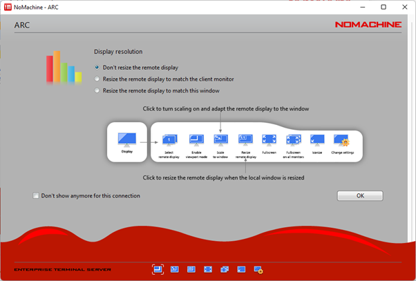

Using the ARC Graphical Interactive Nodes
-----------------------------------------

ARC have a number of graphical interactive nodes which you can use to interact with applications which require GUI operation, such as RStudio, Jupyter Notebooks
and ANSYS Workbench.

In order to use these interactive nodes, you must be connected to the university network or be connected via the university VPN service. 

**Accessing the Graphical Interactive nodes**

You can connect directly via web browser to `nx.arc.ox.ac.uk <https://nx.arc.ox.ac.uk>`_ via the web-based client connection (which is lower quality in terms of
visual display). See `Configuring NoMachine Web Client <https://arc-user-guide.readthedocs.io/en/latest/arc-nx-web.html`_

Alternatively you can download the `NoMachine Enterprise Client <https://www.nomachine.com/download-enterprise#NoMachine-Enterprise-Client>`_ and install this on your
local machine. See `Configuring NoMachine Client <https://arc-user-guide.readthedocs.io/en/latest/arc-nx-client.html`_

**Configuring NoMachine client access**

Step 1: After starting the client, click ``Add`` on the first screen to add a new connection. On the next screen give the connection a name, in the example below we have used ``ARC`` you **must** specify the host as ``nx.arc.ox.ac.uk``

.. image:: images/arc-client.png
  :width: 800
  :alt: Client Install Start

.. image:: images/arc-client1.png
  :width: 800
  :alt: Client Install Stage 1
  
Step 2: Enter your ARC username and password:

.. image:: images/arc-client2.png
  :width: 800
  :alt: Client Install Stage 2
  
Step 3: Either connect to an existing desktop session if you have one, or use the ``New Desktop`` button to create a new session...

.. image:: images/arc-client3.png
  :width: 800
  :alt: Client Install Stage 3
  
...then click the ``Create new virtual desktop`` button to complete the process.
  
.. image:: images/arc-client4.png
  :width: 800
  :alt: Client Install Stage 4
  
Step 4: Use the options on the following screens to configure how you would like the remote desktop session to be displayed on your local machine:

.. image:: images/arc-client5.png
  :width: 800
  :alt: Client Install Stage 5
  

  
After clicking ``OK`` the connection will be made and you will be presented with the Linux KDE desktop in a window on your machine. The menu bar for accessing applications is at the bottom of this window.
