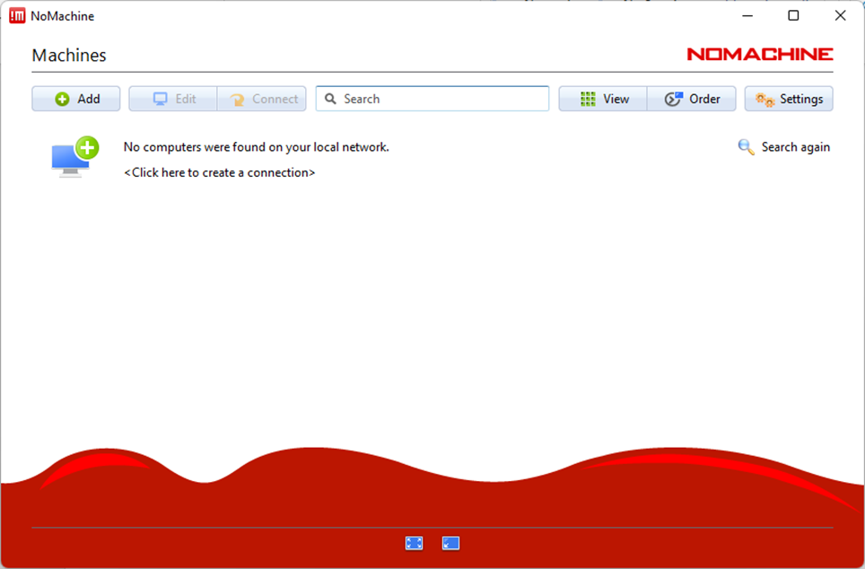
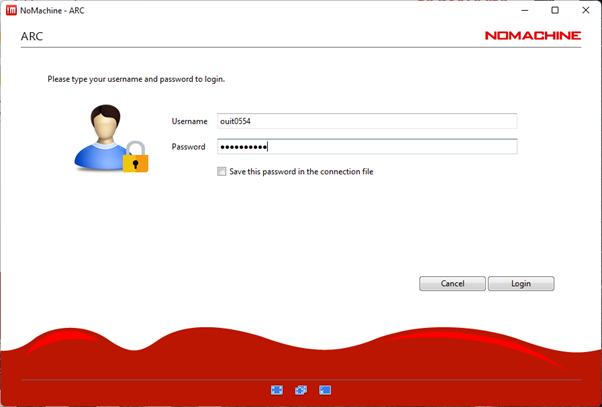
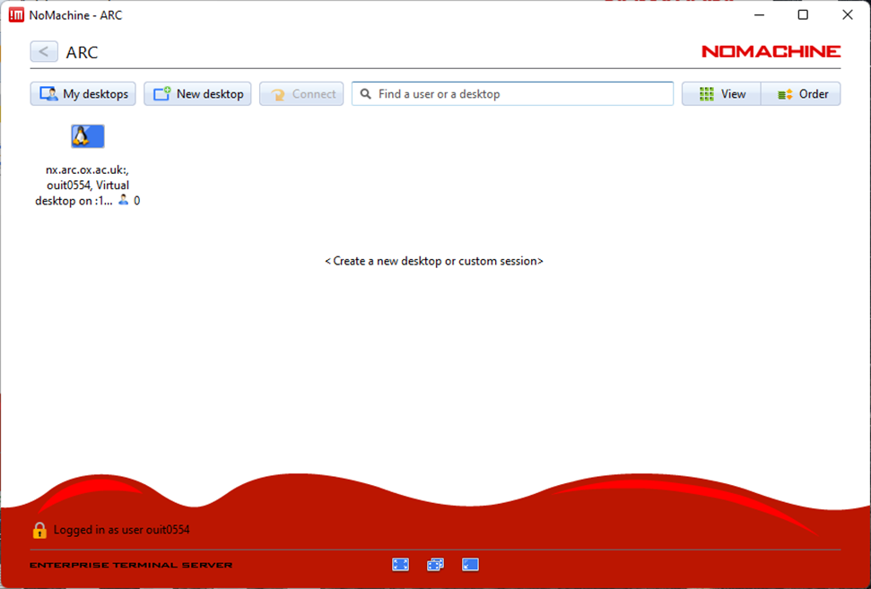
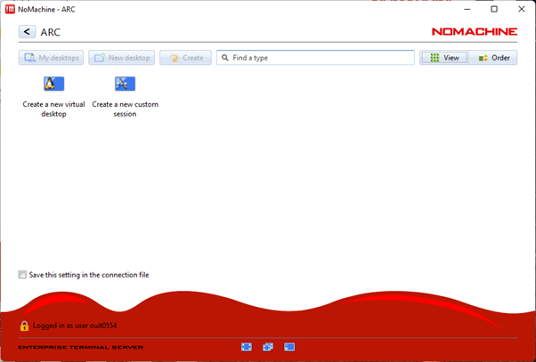
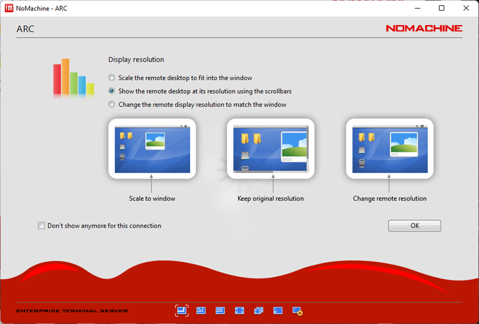

Using the ARC Graphical Interactive Nodes
-----------------------------------------

ARC have a number of graphical interactive nodes which you can use to interact with applications which require GUI operation, such as RStudio, Jupyter Notebooks
and ANSYS Workbench.

In order to use these interactive nodes, you must be connected to the university network or be connected via the university VPN service. 

**Accessing the Graphical Interactive nodes**

You can connect directly via web browser to `nx.arc.ox.ac.uk <https://nx.arc.ox.ac.uk>`_ via the web-based client connection (which is lower quality in terms of
visual display).

Alternatively you can download the `NoMachine Enterprise Client <https://www.nomachine.com/download-enterprise#NoMachine-Enterprise-Client>`_ and install this on your
local machine.

**Configuring NoMachine client access**

Step 1: After starting the client click ``Add Connection`` and on the next screen give the connection a name, in the example below we have used ``ARC`` and specify the host as ``nx.arc.ox.ac.uk``

.. image:: images/arc-client1.png
  :width: 800
  :alt: Client Install Stage 1
  

Step 2: enter your ARC username and password:

  
Step 3: Either connect to an existing desktop session if you have one, or use the ``New Desktop`` button to create a new session...

  
...then use click ``Create new virtual desktop``  to complete the process.
  

  
Step 4: Use the options to configure how you would like the remote desktop session to be displayed on your machine

  
