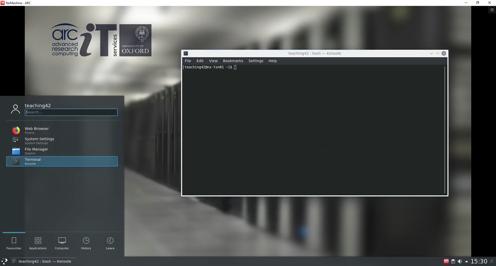

Using the ARC Graphical Interactive Nodes
-----------------------------------------

.. warning::
   This service is currently in beta test and we welcome feedback on the provided features and applications. Be aware that as the service 
   is under development it is likely to interruption and change.   

ARC have a number of graphical interactive nodes which you can use to interact with applications which require GUI operation, such as RStudio, Jupyter Notebooks
and ANSYS Workbench.

In order to use these interactive nodes, you must be connected to the university network or be remotely connected via the university VPN service. 

**Accessing the Graphical Interactive nodes**

You can connect directly via web browser to `nx.arc.ox.ac.uk <https://nx.arc.ox.ac.uk>`_ via the web-based client connection (which is lower quality in terms of
visual display). See `Configuring NoMachine Web Client <https://arc-user-guide.readthedocs.io/en/latest/arc-nx-web.html>`_

Alternatively you can download the `NoMachine Enterprise Client <https://www.nomachine.com/download-enterprise#NoMachine-Enterprise-Client>`_ and install this on your
local machine. See `Configuring NoMachine Client <https://arc-user-guide.readthedocs.io/en/latest/arc-nx-client.html>`_

  
**Using the desktop environment**

Once you have connected to the NoMachine server by one of the above methods you will be presented with the ARC desktop environment as shown below:

.. image:: images/arc-desktop.png
  :width: 800
  :alt: ARC Desktop
  
You can use the menu bar at the bottom of the window to access applications or, as in the example below, open the ``Konsole`` terminal window:

  
.. note::
  While it may look like you have your own Linux desktop to work with, the interactive nodes where you are running this desktop are 
  shared with other ARC users, and therefore it is very important that you do not run computationally demanding jobs. 
  
  To run jobs that are more demanding than simple GUI application usage, please open a ``Konsole`` window and start an interactive X11 
  session on an interactive compute node by following the instructions below:
              
  To run an interactive session on the ARC cluster::
  
     module load cluster/arc
     srun -p interactive --x11 --pty /bin/bash
    
  To run an interactive session on the HTC system::
                
     module load cluster/htc
     srun -p interactive --x11 --pty /bin/bash
                
              
**Running applications**
  
There are a number of predefined applications which you can find under the ``ARC`` sub-menu, within the ``Applications`` section of the main menu bar, see below for examples:
  
  .. image:: images/arc-apps1.png
    :width: 800
    :alt: ARC Apps Menu
  
Applications|ARC Sub-menu 
  
  .. image:: images/arc-apps2.png
    :width: 350
    :alt: ARC Apps List

Clicking on these menu items will start up the appropriate version of the specified application, with any other required modules automatically loaded.

.. note::
   If you need customised versions of applications or supporting modules (such as custom Anaconda virtual environments) you should load/activate these as
   appropriate from the ``Konsole`` command window, in the same way as the ARC or HTC systems.
   
   
