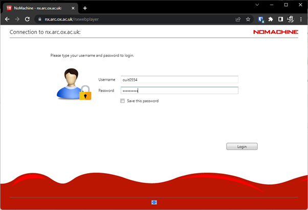
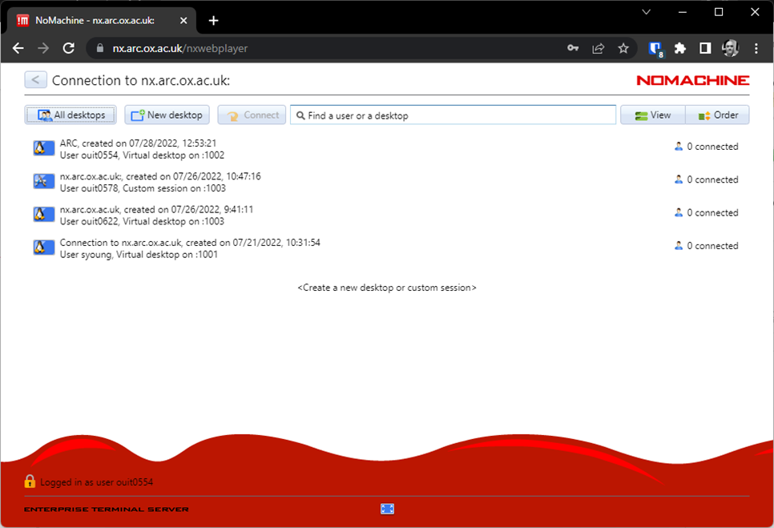
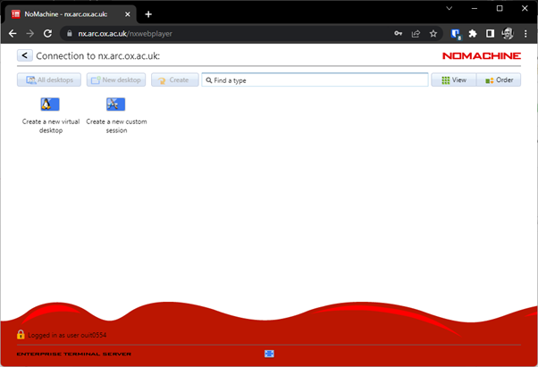

Configuring NoMachine Web Access
--------------------------------

Step 1: From your browser go to `nx.arc.ox.ac.uk <https://nx.arc.ox.ac.uk>`_ and log in with your ARC username and password:

Step 2: Either connect to an existing desktop session if you have one, or use the ``New Desktop`` button to create a new session...

  
Step 3: Click the ``Create new virtual desktop`` button to complete the process...
  

  
After clicking ``OK`` the connection will be made and you will be presented with the Linux KDE desktop in a window on your machine. The menu bar for accessing applications is at the bottom of this window.
